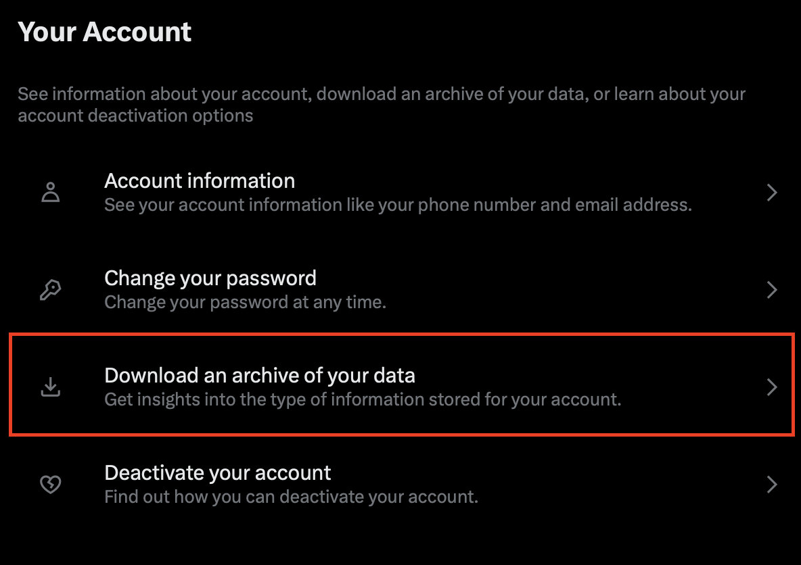
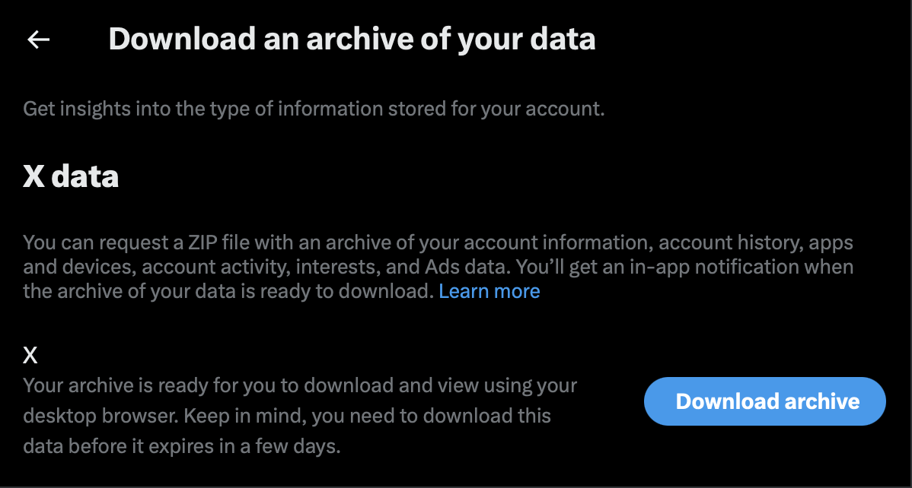
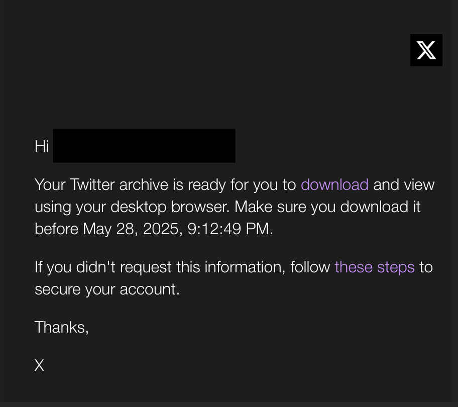
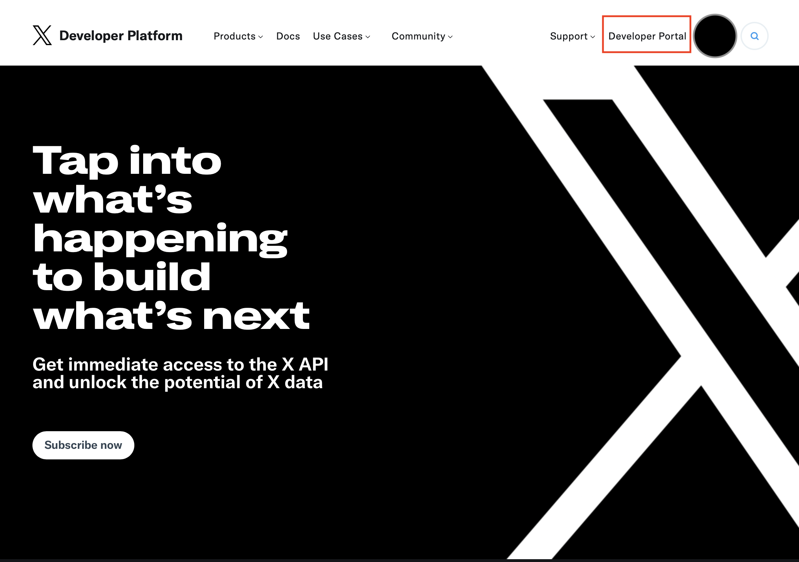
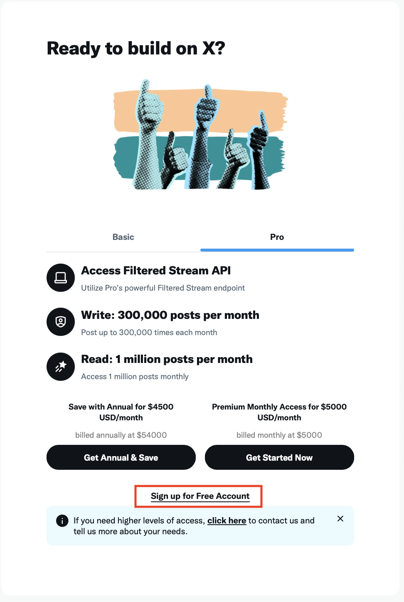
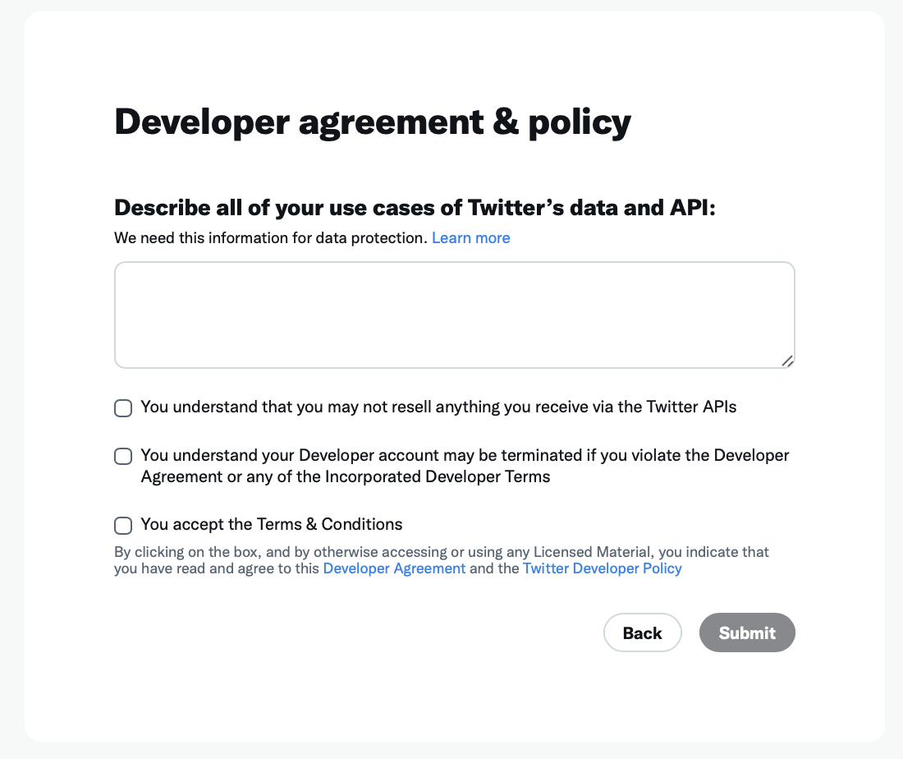
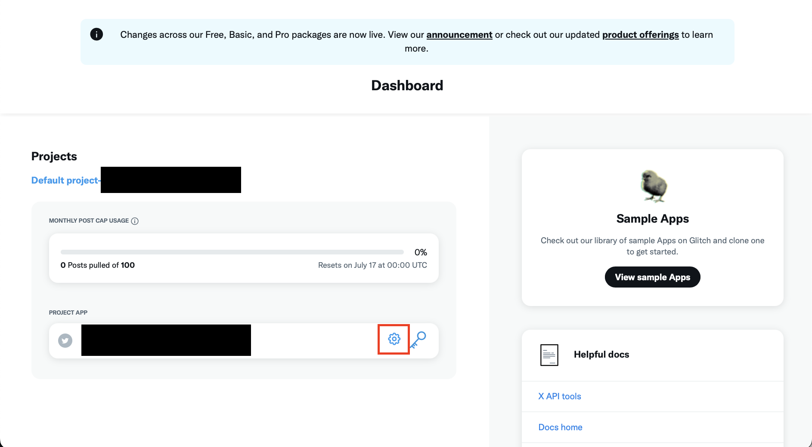
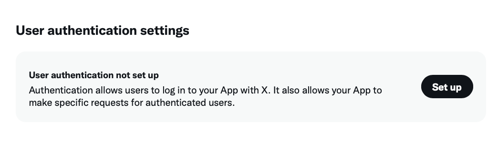
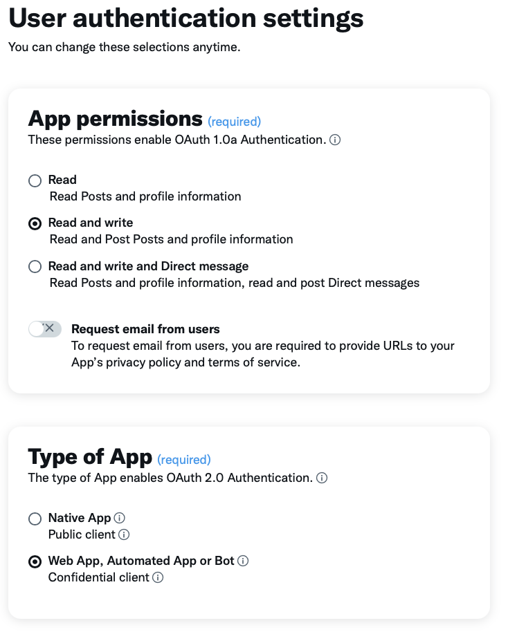
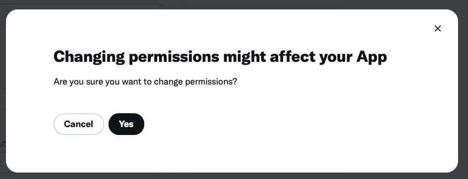

<!-- Analytics -->

<!-- Head -->

<link rel="stylesheet" href="https://fonts.googleapis.com/css2?family=Open+Sans:wght@400;600&display=swap" rel="stylesheet">

<!-- Styling -->

<!-- Title -->

<h1>How to: Tweet Detox 🧹 </h1>

<h2>A step-by-step tutorial on how to clean up your digital X (formerly Twitter) footprint 👣</h2>

<h4> By: MJ  </h4>

  <a href="https://instagram.com/madeintanzania" target="_blank">📷 @madeintanzania</a>

<!-- Table of contents -->

<h2>🧭 Table of Contents</h2>

<ul>
  <li><a href="#introduction">🙋🏾‍♀️ Introduction</a></li>
  <li><a href="#legal-responsible-use">⚠️ Legal & Responsible Use</a></li>
  <li><a href="#what-youll-need">📖 What You’ll Need</a></li>
  <li><a href="#estimated-time-breakdown">⏳ Estimated Time Breakdown</a></li>
  <li><a href="#instructions">📝 Instructions</a>
    <ul>
      <li><a href="#step-1">Step 1: Download Necessary Files</a></li>
      <li><a href="#step-2">Step 2: Download Your Archive</a></li>
      <li><a href="#step-3">Step 3: Create an X Developer Account</a></li>
      <li><a href="#step-4">Step 4: Set Up Your API Keys</a></li>
      <li><a href="#step-5">Step 5: Install Python</a></li>
      <li><a href="#step-6">Step 6: Run the Script</a></li>
    </ul>
  </li>
  <li><a href="#mission-accomplished">🏆 Mission Accomplished!</a></li>
  <li><a href="#questions-comments-concerns">💬 Questions? Comments? Concerns?</a></li>
</ul>

<!-- Introduction --> 

<h2 id="introduction">🙋🏾‍♀️ Introduction</h2>

Hello 👋🏾 and welcome! My name is Me, and I'm a Senior Software Engineer specialized in iOS 📲.

With privacy getting harder to protect as technology advances, I've been working on cleaning up my digital footprint. One of my biggest missions? Deleting my old tweets. I've had my account since high school.. and I am <strong>embarazzed</strong> by the things I used to do and say! Like what was I even talking about? lol

I searched <strong>everywhere</strong> for tools to wipe them, but most were either broken, sketchy, or required payment. Just as I was about to give up, I had a lightbulb moment and realized: <strong>I can do it myself</strong> 💡

With a little research and effort, I put together a script that helped me delete over <strong>40,000 tweets 🎉</strong>. After sharing it with friends, I got a lot of requests to help others do the same. So, here we are.

  <strong>This tutorial is beginner friendly.</strong> No tech experience is needed. This runs 100% local, so your data never leaves your machine. No logins, no hidden apps -- just you, your archive, and a script 😀

Just follow my lead, and let me know if you run into issues. Let's get into it! 🚀

<!-- Legal & Responsible Use --> 

<h2 id="legal-responsible-use">⚠️ Legal & Responsible Use </h2>

Now.. before we start, I'd like to avoid any legal trouble 😅. So here's a quick disclaimer before we continue:

<strong>This tool is for educational and personal use only.</strong>

By using this script, you agree to the following:

- You will use <strong>your own X (formerly Twitter) Developer App credentials</strong>.

- You will not share, sell, or distribute your API keys or access tokens.

- You will not use this tool to access or delete tweets from any account that is not your own.

- You are responsible for staying within X’s Developer Agreement and Rate Limit policies.

This script is <strong>not affiliated with or endorsed by X/Twitter</strong>. Use at your own risk. The author assumes no liability for misuse, bans, or accidental tweet deletions.

<strong>Long story short:</strong> This script is just for cleaning up your <strong>own</strong> account. Don’t share your keys with <strong><em>anyone</em></strong>, don't do anything <strong><em>shady</em></strong>, and you'll be fine. This tool is not affiliated with X/Twitter. It's just a personal tool to help you take control of your content

Great! Lets get started.. 🏃🏾‍♀️

<!-- What You'll Need --> 

<h2 id="what-youll-need"> 📋 What You’ll Need </h2>

<ul>
  <li>💻 A computer (Mac or Windows)</li>
  <li>🛜 Access to the internet</li>
  <li>🙏🏾 Patience and perseverance</li>
</ul>

<strong>Note:</strong> I personally use a Mac, but I did my best to include Windows steps throughout this guide. Let me know if anything's unclear!

<!-- Estimated Time Breakdown --> 

<h2 id="estimated-time-breakdown">⏳ Estimated Time Breakdown</h2>

  <strong>⏱️ Total Active Time: ~30–45 mins</strong>   
  🧘🏾‍♀️ Plus passive wait time for archive downloads & the script to complete

<table>
  <thead>
    <tr>
      <th>Step</th>
      <th>Description</th>
      <th>Time</th>
    </tr>
  </thead>
  <tbody>
    <tr>
      <td>📁 Step 1</td>
      <td>Download necessary files</td>
      <td>3–5 min</td>
    </tr>
    <tr>
      <td>⬇️ Step 2</td>
      <td>Download your archive</td>
      <td>5 min + wait</td>
    </tr>
    <tr>
      <td>🛠 Step 3</td>
      <td>Create an X Developer Account</td>
      <td>10–15 min</td>
    </tr>
    <tr>
      <td>🔑 Step 4</td>
      <td>Setup your API Keys</td>
      <td>2–4 min</td>
    </tr>
    <tr>
      <td>🐍 Step 5</td>
      <td>Install Python</td>
      <td>3–10 min</td>
    </tr>
    <tr>
      <td>🏃🏾‍♀️ Step 6</td>
      <td>Run the script</td>
      <td>2–5 min (then let it run!)</td>
    </tr>
  </tbody>
</table>

<!-- Instructions -->

<h2 id="instructions">📝 Instructions<h2>

<!-- Step 1 - Download Necessary Files -->

<h3 id="step-1">Step 1: Download Necessary Files</h3>

  For the sake of simplicity -- and making the next steps easier -- I recommend saving all your files to your <strong>Desktop</strong>. This folder will be your working directory for the rest of the setup.

<ul>
  <li>
    Click below to download the setup files:
    <ul>
      <li><a href="resources/tweet-detox.zip">👉🏾 Download tweet-detox.zip</a></li>
    </ul>
  </li>
  <li>
    Depending on your computer's setup, your browser may either ask where to save the file, or automatically download it to your default folder (most likely <strong>Downloads</strong>).
    <ul>
      <li>In either case, move <code>tweet-detox.zip</code> to your <strong>Desktop</strong></li>
    </ul>
  </li>
  <li>
    Then unzip it:
    <ul>
      <li>On <strong>Mac</strong>: double-click the file</li>
      <li>On <strong>Windows</strong>: right-click → <strong>Extract All</strong></li>
    </ul>
  </li>
  <li>
    You should now see the unzipped <code>tweet-detox</code> folder on your Desktop ✅
  </li>
</ul>

<!-- Step 2: Download your archive -->

<h3 id="step-2">Step 2: Download your archive</h3>

Lets head on over to your internet browser 🔍

<!-- Request to download archive-->

  
Request to download archive

  <ul>
    <li>Log in to your X account</li>
    <li>
      Go to <a href="https://x.com/settings/account" target="_blank">your account settings</a>
    </li>
    <li>Click <strong>Download an archive of your data</strong></li>
  </ul>

  

    
  

  <ul>
    <li>You will be asked to verify your password, then enter the code sent to your email</li>
    <li>Once you're in, you should see something like this:</li>
  </ul>

  

    
  

  <ul>
    <li>
      Click <strong>Request archive</strong>, and wait for a confirmation email or notification.
      This can take anywhere from a few minutes to several hours ⏳
    </li>
  </ul>

<!-- Download your archive -->

  
Download your archive

  <ul>
    <li>When you get the email, open the link (or revisit the account settings page)</li>
    <li>After verifying again, you'll be able to download your archive</li>
  </ul>

  

    
  

  <ul>
    <li>Click <strong>Download archive</strong></li>
  </ul>

  

    
  

  <ul>
    <li>
      To make the next steps easier, save the <code>.zip</code> file to the
      <code>tweet-detox</code> folder from Step 1. The downloaded archive should begin with
      <code>twitter-2025-...</code>
    </li>
  </ul>

  

    ⏳ This download may take some time, depending on how active your X account has been.
  

<!-- Open your archive -->

  
Open your archive

  <ul>
    <li>Unzip the file.</li>
    <li>Inside the unzipped folder, open the folder named <code>data</code>.</li>
    <li>
      The only file we need is <code>tweets.js</code> — this contains <strong>all</strong> your tweets and retweets.
    </li>
    <li>
      Copy <code>tweets.js</code> and paste it into the <strong>main</strong> <code>tweet-detox</code> folder (outside of the unzipped archive).
    </li>
  </ul>

  

    <strong>✨ Bonus:</strong> You can open <code>Your archive.html</code> for a visual overview of your entire account history. Double-clicking the file should open it in your browser.
  

<!-- Step 3: Create an X Developer Account -->

<h3 id="step-3">Step 3: Create an X Developer Account</h3>

Okay, this part's the longest to actively get through, but <strong>I promise, it's not hard</strong>. Take your time, and follow along, and you'll be done in no time! 🛠️✨

<!-- Create a developer account -->

Create a developer account

In order to run the tweet deletion script, you'll need a set of API credentials. This means creating a <strong>developer account</strong> with X (formerly twitter). This is free, and you only need basic access.

<ul>
  <li>Go to the <a href="https://developer.x.com/en/portal/dashboard" target="_blank">X Developer Portal</a></li>
  <li>You'll be asked to log in with your X account (if you aren't already)</li>
  <li>If you land on a marketing/landing page, click <strong>Developer Portal</strong> in the top right</li>
</ul>

  

<ul>
  <li>You'll see a screen like this, click <strong>Sign up for Free Account</strong></li>
</ul>

  

<ul>
  <li>You'll be prompted to describe how you plan to use the API. This helps ensures you're not using it for anything shady</li>
</ul>

  

<ul>
  <li>The description needs to be at least 250 characters, stating how exactly you plan to use the API. This is what i wrote (w/ the help of ChatGPT):</li>
</ul>

  <em>
    I am using a personal script to delete old tweets from my own account as part of cleaning up my digital footprint. 
    I will only use my own X Developer credentials, and won't share or sell them 
    I will not access or delete tweets from any account that is not my own. 
    This script is for personal use only, and complies with X's policies.
  </em>

<ul>
  <li>Once you're done, and agree to all the terms, click <strong>Submit</strong>. Approval is usually instant, and you'll land in the Developer Portal Dashboard</li>
</ul>

<!-- Generate authentication keys -->

Generate authentication keys

<ul>
  <li>On the landing page, you should see a default project and app already created (basic plan only allows one). Click the <strong>gear icon ⚙️</strong> next to your App to configure authentication</li>
</ul>

  

<ul>
  <li>On the app details page, click <strong>Set up</strong> under <strong>User authentication settings</strong></li>
</ul>

  

<ul>
  <li>Fill in these details <strong>exactly</strong> as shown:</li>
</ul>

  

<ul>
  <li>
  Under <strong>App Info</strong>, enter the following:
    <table>
    <thead>
        <tr>
        <th><strong>Field</strong></th>
        <th><strong>Value</strong></th>
        </tr>
    </thead>
    <tbody>
        <tr>
        <td>Callback URL</td>
        <td><code>https://example.com/callback</code></td>
        </tr>
        <tr>
        <td>Website URL</td>
        <td><code>https://example.com</code></td>
        </tr>
    </tbody>
    </table>
  </li>
</ul>

  <strong>Wait, why does it say example.com?</strong> 
  X (Twitter) requires valid-looking URLs during setup, but we’re not hosting a real website. 
  <code>https://example.com</code> just makes setup work — nothing gets sent there 👍🏾

<ul>
  <li>When prompted, click <strong>Yes</strong> to confirm your changes</li>
</ul>

  

<ul>
  <li>Once setup is complete, you'll be shown your client key and token.</li>
</ul>

    <strong>🚨 Save these somewhere safe</strong> — they won’t be shown again! 🚨

<!-- Create more keys and tokens -->

Create more keys and tokens

<ul>
  <li>Navigate back to the app details page, click on <strong><em>Keys and Tokens</em></strong></li>
</ul>

<ul>
  <li>Under <strong>Consumer Keys</strong>:
    <ul>
      <li>Click <strong>Regenerate</strong></li>
      <li>This will give you both your <strong>API key</strong> and <strong>Secret key</strong></li>
      <li>Save both in the same secure place you used for the authentication keys</li>
    </ul>
  </li>
</ul>

<ul>
  <li>Under <strong>Authentication Tokens</strong>:
    <ul>
      <li>Click <strong>Regenerate</strong> next to "Access Token and Secret"</li>
      <li>This will generate the <strong>Access token</strong> and <strong>Access token secret</strong> key</li>
      <li>Save these as well!!</li>
    </ul>
  </li>
</ul>

<!-- Step 4: Set up your API keys -->

<h3 id="step-4">Step 4: Set up your API keys</h3>

Now that you've got your credentials, it's time to put them to use.

<ul>
  <li>Open your <code>tweet-detox</code> folder on your <strong>Desktop</strong></li>
  <li>Locate the file named <code>env-template.txt</code></li>
  <li>Right-click the file and choose <strong>Open With</strong> → your preferred text editor (Notepad, TextEdit, VS Code, etc.)</li>
  <li>Replace each instance of <code>your_api_key_here</code> with the actual credentials you saved in the previous step</li>
  <li>Save the file, and close the editor</li>
  <li>Finally, rename <code>env-template.txt</code> to <code>.env</code>. It must be renamed to <strong>exactly</strong> this, nothing more, nothing less.</li>
</ul>

  ⚠️ Don’t be alarmed if the file seems to disappear after renaming — files that start with a <code>.</code> are hidden by default on some systems. It’s still there!  
  <strong>To make it visible:</strong>
  <ul>
    <li>On <strong>Mac</strong>: Press <code>Command + Shift + .</code> while in Finder to toggle hidden files.</li>
    <li>On <strong>Windows</strong>: In File Explorer, click <strong>View</strong> > check <strong>Hidden items</strong>.</li>
  </ul>

<!-- Step 5: Install Python -->

<h3 id="step-5">Step 5: Install Python</h3>

Check Python Version

<ul>
  <li>Open your terminal:
    <ul>
      <li><strong>Mac:</strong> Open Terminal (press <code>Command + Space</code> and search for <strong>Terminal</strong>)</li>
      <li><strong>Windows:</strong> Use Command Prompt or Windows Terminal</li>
    </ul>
  </li>

  <li>Type or copy and paste the following:</li>
</ul>

<pre><code>python --version</code></pre>

or if that doesn't work:

<pre><code>python3 --version</code></pre>

If you see something like <code>Python 3.x.x</code>, you’re all set! Skip to the next step 🐍🎉

Don't have it? here's how to install

<ul>
  <li>Go to <a href="https://www.python.org/downloads/" target="_blank">python.org/downloads</a></li>
  <li>Click <strong>Download Python 3.X.X</strong></li>
  <li>Run the installer and follow the steps:
    <ul>
      <li>⚠️ On <strong>Windows</strong>, be sure to check <strong>Add Python to PATH</strong> before clicking install!</li>
    </ul>
  </li>
  <li>Once done, try running the version command again to confirm it worked</li>
  <li>If this doesn't work, try restarting the terminal and try confirming again</li>
</ul>

